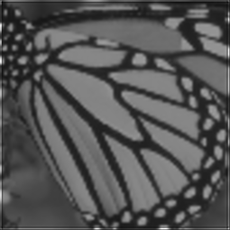

# Super Resolution Deep NN

Requires tensorflow==1.15

## Super resolution with Deep Neural Networks in Tensorflow 

### Ground Truth

### HR-Bicupic

### HR-SRCNN

PSNR compared to ground truth 

`The PSNR of GT and Output iss 20.746992960220606, the PSNR of GT and Blurred Image is 20.497630173285614`
